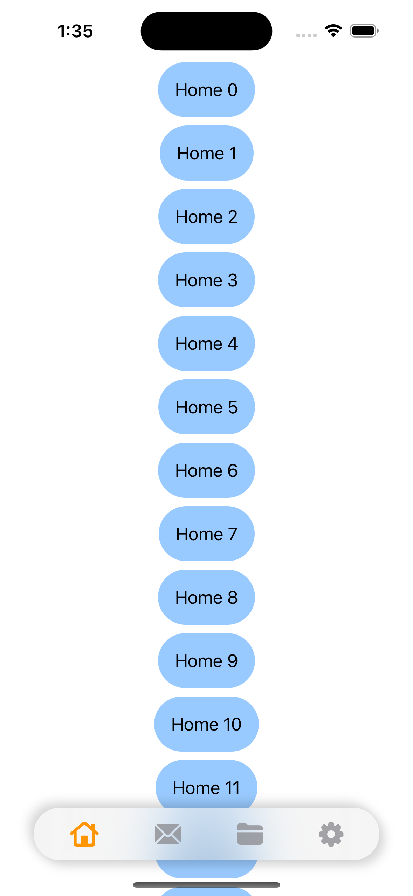
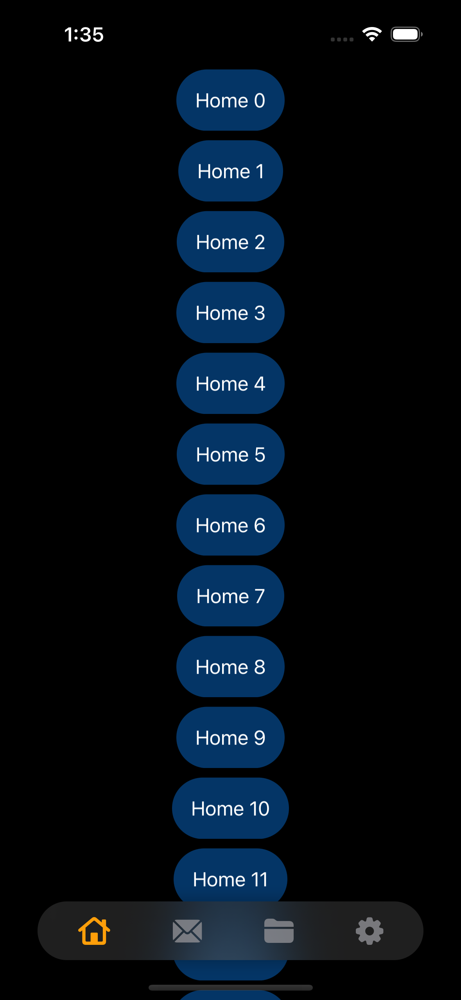

# CustomTabBar with SwiftUI

A SwiftUI demo project.

<table>
<thead>
   <tr>
        <th colspan="5">
Screenshots
</th>
  </tr>
</thead>
<tbody>
   <tr>
       <td>
          
      </td>
        <td>
          
        </td>
  </tr>

  <tr> 
     <th colspan="5">
     

        <b>Demo</b>

</th>
  </tr>
  <tr>
     <td colspan="5">   

https://github.com/AliMert/CustomTabBar-SwiftUI/assets/37440706/5170d061-725e-4a67-a11f-8d940e5e35f7

  </tr>
</tbody>
</table>
